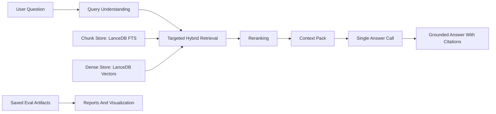

# Architecture

This document is the compact walkthrough for the final demo path.

## End-To-End Flow

## Query Understanding

What it does:

- detects company names and ticker aliases
- extracts simple date or year cues when present
- adds deterministic query-targeting hints before retrieval

Why it exists:

- SEC questions often name companies directly
- targeted retrieval is more reliable for comparison prompts than a raw dense query alone

Current main path:

- deterministic heuristic analysis
- no mandatory LLM rewrite step before retrieval

## Embeddings

What it does:

- turns filing chunks and dense queries into vectors for semantic retrieval

Why it exists:

- dense retrieval improves recall when the question wording does not match filing phrasing exactly

Current main path:

- code/config default embedder: `snowflake-arctic-embed-xs`
- the currently committed local dense artifact snapshot still points at `hashed_v1`
- saved provider artifacts preserve both paths explicitly instead of pretending they are the same thing

## Database And Retrieval

What it does:

- stores chunk text, metadata, and dense vectors locally
- supports lexical, dense, hybrid, and `targeted_hybrid` retrieval modes

Why it exists:

- the demo needs local, inspectable retrieval that can be restored from a release archive
- SEC filing questions benefit from both exact-term matching and semantic matching

Current main path:

- LanceDB stores the lexical and dense chunk tables
- reviewer setup restores a prebuilt archive instead of rebuilding indexes locally
- recommended demo mode for named-company prompts: `targeted_hybrid`

## Reranking

What it does:

- reorders the retrieved candidate set before answer generation

Why it exists:

- initial retrieval gets recall; reranking improves which chunks reach the final prompt

Current main path:

- explicit reranking is enabled for the recommended demo flow
- default reranker: `bge-reranker-v2-m3`
- saved artifacts also preserve a bounded comparison against `bge-reranker-base`

## Answer Generation

What it does:

- produces the final response from the retrieved context pack

Why it exists:

- the assignment requires one final answer-generation call rather than a multi-step agentic answer loop

Current main path:

- one final LLM call
- inline citations are required in the answer text
- supported paths include hosted OpenAI-compatible backends and a repo-supported local Ollama fallback

## Evaluation And Judge Layer

What it does:

- records saved retrieval and answer artifacts for a frozen eval slice
- adds judged overlays, markdown reports, and visualizations on top of those saved artifacts

Why it exists:

- the project needs a defensible demo story that can compare component choices without rerunning everything live

Current main path:

- raw `eval/*.json` artifacts are the evidence base
- `*_answer_judged.json` files are interpretation overlays
- `eval/provider_eval_visualization_judged.png` is the main presentation artifact for live discussion
- reports and plots are read-only outputs derived from saved artifacts, not replacement truth

## What To Emphasize In A Live Walkthrough

- the retrieval stack is local and restorable
- the answer path is single-call and citation-grounded
- the evaluation layer is artifact-driven
- judged visualizations help explain tradeoffs, but the raw saved artifacts remain the underlying evidence
