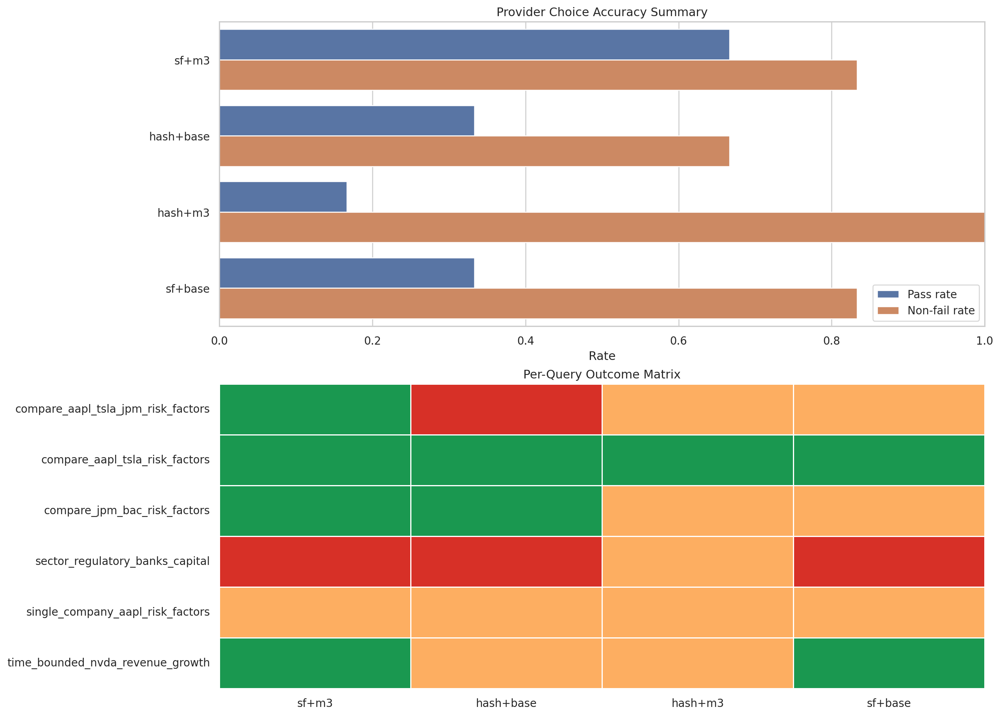

# eliza-rag

Portable SEC filings RAG demo: restore a prebuilt local index, ask a question, inspect grounded citations, and discuss the saved evaluation artifacts.

The main demo contract is:

1. clone the repo
2. restore the published LanceDB archive
3. choose a local or hosted LLM
4. run one answer command

## Requirements And Assumptions

This repo assumes the reviewer is running on a reasonably current macOS or Linux machine with:

- Python 3.12 or newer
- `uv` available on the command line
- internet access for the initial dependency install, archive download, and any first-run model downloads
- enough local disk space for the repo, restored LanceDB archive, and any local model artifacts

If you plan to use the local LLM path, it also assumes:

- Ollama can be installed and run on the machine
- the machine has enough CPU, RAM, and disk for the selected Ollama model and retrieval-time model downloads

Windows is not the primary target environment for this demo, but a reasonable best-effort path is:

- use PowerShell or Git Bash
- install `uv` using the official Windows instructions
- prefer the hosted LLM path first
- treat Ollama and local-model setup on Windows as less tested than macOS or Linux

If `uv` is not installed yet, install it first.

macOS and Linux:

```bash
curl -LsSf https://astral.sh/uv/install.sh | sh
```

Windows PowerShell:

```powershell
powershell -ExecutionPolicy ByPass -c "irm https://astral.sh/uv/install.ps1 | iex"
```

Then restart your shell, or confirm it is available:

```bash
uv --version
```

## Reviewer Quickstart

Install dependencies:

```bash
uv sync
```

Restore the prebuilt retrieval state from a GitHub Release archive:

```bash
export ELIZA_RAG_LANCEDB_ARCHIVE_URL=https://github.com/jtroybaker/eliza-rag/releases/download/v1.0.0/lancedb-demo.zip
uv run eliza-rag-storage fetch-archive
```

### Local LLM Path

Install Ollama if needed:

```bash
curl -fsSL https://ollama.com/install.sh | sh
```

Then prepare the local fallback and ask a question:

```bash
export ELIZA_RAG_LLM_PROVIDER=local_ollama
export ELIZA_RAG_LLM_MODEL=qwen2.5:3b-instruct
uv run eliza-rag-local-llm prepare
uv run eliza-rag-answer "What are the primary risk factors facing Apple, Tesla, and JPMorgan, and how do they compare?"
```

`uv run eliza-rag-local-llm prepare` now warms the local Ollama model and the retrieval-time models used by the recommended demo path, so the first real question is less likely to stall on downloads.

### Hosted LLM Path

If you already have an API key in `.env.local`, you can skip Ollama.

Recommended `.env.local` entries:

```bash
ELIZA_RAG_OPENAI_API_KEY=your_openai_key_here
ELIZA_RAG_OPENROUTER_API_KEY=your_openrouter_key_here
```

Then choose one hosted provider:

OpenAI:

```bash
export ELIZA_RAG_LLM_PROVIDER=openai
uv run eliza-rag-answer "What are the primary risk factors facing Apple, Tesla, and JPMorgan, and how do they compare?"
```

OpenRouter:

```bash
export ELIZA_RAG_LLM_PROVIDER=openrouter
export ELIZA_RAG_LLM_MODEL=openai/gpt-5-mini
uv run eliza-rag-answer "What are the primary risk factors facing Apple, Tesla, and JPMorgan, and how do they compare?"
```

The repo still accepts the older shared hosted-answer variable `ELIZA_RAG_LLM_API_KEY`, but reviewer setup should prefer the provider-specific keys above.

Useful follow-up commands:

```bash
uv run eliza-rag-search "Compare the main risk factors facing Apple and Tesla" --mode targeted_hybrid --top-k 5 --rerank
uv run eliza-rag-answer "How has NVIDIA's revenue and growth outlook changed over the last two years?" --json
```

### One-Page Frontend

If you want the demo flow without operating in the CLI, run the Streamlit app:

```bash
uv run streamlit run streamlit_app.py
```

The page wraps the same repo flows:

- restore the published archive
- check or prepare the Ollama local runtime
- run retrieval-only search
- run the full grounded answer flow

## What The Project Does

This repo answers business questions over SEC filings with a local retrieval stack and one final answer-generation call.

The current default demo path is:

- deterministic query analysis to detect companies and simple time cues
- targeted hybrid retrieval over a local LanceDB index
- explicit reranking with `bge-reranker-v2-m3`
- one final grounded answer with inline chunk citations

The recommended retrieval mode for named-company comparison prompts is `targeted_hybrid` with reranking enabled, and `eliza-rag-answer` now defaults to that reviewer-facing path.

## Pipeline At A Glance

- Query understanding: lightweight deterministic parsing extracts company aliases, ticker hints, and simple date bounds.
- Embeddings and retrieval: chunk embeddings and lexical search live in local LanceDB tables so the demo can run from a restored archive instead of a fresh rebuild.
- Reranking: top candidates are reranked before the final context pack is built.
- Answer generation: a single LLM call produces the user-facing answer and inline citations.
- Evaluation: the repo keeps saved retrieval, answer, and judged-overlay artifacts so the demo story stays tied to inspectable files rather than transient runs.

For the compact walkthrough version, see `ARCHITECTURE.md`.

## Evaluation Story

This repo evaluates the system with a small frozen query set in `eval/golden_queries.json` and a bounded set of retrieval and reranking configurations. That approach fits the project well: the goal here is not leaderboard scale, but a reviewer-readable comparison of how retrieval choices affect grounded answers over the same questions and saved corpus state.

The evidence is preserved in layers so the evaluation can be inspected directly:

- raw `*_answer.json` artifacts show the actual answer behavior for each saved run
- `*_answer_judged.json` overlays add a consistent interpretation layer on top of those answers
- read-only reports and the judged visualization summarize those artifacts so differences across configurations are easier to compare

The current judged summary from `eval/provider_eval_report_judged.md` shows a clear spread across the saved variants:

- Snowflake + `bge-reranker-v2-m3`: `4 pass / 1 partial_pass / 1 fail`
- `hashed_v1` + `bge-reranker-v2-m3`: `1 pass / 5 partial_pass / 0 fail`
- `hashed_v1` + `bge-reranker-base`: `2 pass / 2 partial_pass / 2 fail`
- Snowflake + `bge-reranker-base`: `2 pass / 3 partial_pass / 1 fail`

Taken together, those saved runs suggest that the Snowflake retriever paired with `bge-reranker-v2-m3` produced the strongest judged behavior in this evaluation slice, while the other combinations more often degraded to partial passes or failures. For a reviewer, the point is not a single definitive score; it is that the repo makes the retrieval tradeoffs visible and auditable through stored answers, overlays, and reports rather than through claims alone.

The visualization that helps tell that story is:

- `eval/provider_eval_visualization_judged.png`



It is useful because it makes the relative pattern across configurations easy to scan alongside the underlying saved artifacts.

## Maintainer Notes

The reviewer path is restore-first. Maintainers can still rebuild or republish artifacts when needed:

```bash
uv run eliza-rag-load-chunks
uv run eliza-rag-build-dense-index
uv run eliza-rag-storage compact --optimize --cleanup-older-than-hours 0 --delete-unverified
uv run eliza-rag-storage package-archive
```

## Further Reading

- `ARCHITECTURE.md`: compact pipeline walkthrough for live explanation
- `docs/streamlit-packet/README.md`: full educational packet for how the Streamlit app works from the ground up
- `eval/README.md`: saved eval artifacts, exact eval commands, and reporting outputs
