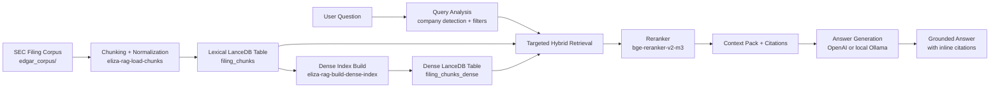

# eliza-rag

Portable SEC filings RAG demo focused on reviewer-friendly local retrieval and a single-call grounded answer path.

The recommended demo distribution path is a GitHub Release ZIP containing `data/lancedb/` plus the dense metadata file. Do not commit the LanceDB artifacts into normal Git history.

## Architecture



## Current Scope

This repository currently includes:

- a `uv`-first Python project setup
- local path and environment configuration
- corpus inspection and optional extraction logic
- filing-level normalization models and parsing
- paragraph-aware baseline chunking with overlap and section carry-forward
- chunk materialization into deterministic chunk rows
- local LanceDB table initialization and loading for chunk records
- lexical full-text retrieval over the local LanceDB chunk table
- deterministic local dense retrieval over a dedicated LanceDB vector table
- reciprocal-rank-fusion hybrid retrieval over lexical and dense candidates
- normalized retrieval result objects with scores, ranks, and preserved metadata
- metadata-aware retrieval filters for ticker, form type, and filing-date bounds
- lightweight structured query analysis hooks for later expansion work
- a saved final prompt template for grounded answer generation
- a single-call answer pipeline over retrieved SEC filing context
- chunk-level citations preserved from retrieval into the final answer payload
- inline citation enforcement in the main answer text
- a terminal-first end-to-end demo command with optional JSON output

Current active phase:

- Phase 06C: metadata-aware query targeting and coverage-preserving retrieval

What is intentionally still in progress:

- stronger deterministic company detection for multi-company questions, especially financial-company prompts
- bounded evaluation to decide whether `targeted_hybrid` is strong enough for the recommended demo path

Important limitation:

- the current structured query analysis is deterministic heuristic logic, not an LLM-based planner or parser
- it can infer year bounds from the query text and add deterministic dense-query expansion terms, but those inferences can be wrong on ambiguous or underspecified questions
- lexical retrieval still uses the raw question text for FTS unless you explicitly add filters or phrase mode

Dense embedding options:

- the default dense retrieval model is now the Hugging Face repo `Snowflake/snowflake-arctic-embed-xs`
- the built-in `hashed_v1` embedding path remains available as the baseline fallback for later evaluation
- to keep baseline and alternate dense indices side by side, use a different dense table name and metadata artifact name for the alternate build

## Requirements

- Python 3.12+
- `uv`

Install `uv` if needed:

```bash
curl -LsSf https://astral.sh/uv/install.sh | sh
```

## Quick Start

The fast happy path for a reviewer is:

1. clone the repo
2. download one prebuilt LanceDB archive from a GitHub Release
3. start the local model helper or point the repo at your hosted model
4. run one answer command

Reranking is now available as an explicit retrieval option. The default reranker is `BAAI/bge-reranker-v2-m3`, while the older deterministic `heuristic` reranker remains available as a fallback.

Authoritative reviewer setup:

Run these commands:

```bash
uv sync
export ELIZA_RAG_LANCEDB_ARCHIVE_URL=https://github.com/YOUR_ORG/YOUR_REPO/releases/download/v1.0.0/lancedb-demo.zip
uv run eliza-rag-storage fetch-archive
curl -fsSL https://ollama.com/install.sh | sh
export ELIZA_RAG_LLM_PROVIDER=local_ollama
export ELIZA_RAG_LLM_MODEL=qwen2.5:3b-instruct
uv run eliza-rag-local-llm prepare
uv run eliza-rag-answer "What are the primary risk factors facing Apple, Tesla, and JPMorgan, and how do they compare?"
```

That is enough to install dependencies, restore the prebuilt retrieval state, prepare a lightweight local model, and run the demo.

If you prefer a hosted LLM instead of local Ollama:

```bash
export ELIZA_RAG_LLM_PROVIDER=openai
export ELIZA_RAG_LLM_API_KEY=your_key_here
uv run eliza-rag-answer "What are the primary risk factors facing Apple, Tesla, and JPMorgan, and how do they compare?"
```

Useful retrieval commands:

```bash
uv run eliza-rag-search "Compare the main risk factors facing Apple and Tesla" --mode targeted_hybrid --top-k 5 --rerank
uv run eliza-rag-search "risk factors" --ticker AAPL --top-k 3 --mode lexical
```

Current recommendation:

- use `targeted_hybrid` for named-company comparison prompts, especially multi-company risk-factor questions
- the Phase 06C company-detection follow-up resolved the prior Apple/Tesla/JPMorgan retrieval blocker well enough to move this path into final evaluation

If you are the publisher and need to rebuild the archive from source artifacts, use:

```bash
uv run eliza-rag-load-chunks
uv run eliza-rag-build-dense-index
uv run eliza-rag-storage compact --optimize --cleanup-older-than-hours 0 --delete-unverified
uv run eliza-rag-storage package-archive
```

Then publish the ZIP with GitHub CLI:

```bash
gh release create v1.0.0 artifacts/lancedb-demo.zip --title "v1.0.0" --notes "Demo LanceDB archive"
```

## Large Index Distribution

The recommended portable artifact is a ZIP created by:

```bash
uv run eliza-rag-storage package-archive
```

That ZIP contains:

- `data/lancedb/`
- `artifacts/dense_index_metadata.json`

Reviewers restore it with:

```bash
export ELIZA_RAG_LANCEDB_ARCHIVE_URL=https://github.com/YOUR_ORG/YOUR_REPO/releases/download/v1.0.0/lancedb-demo.zip
uv run eliza-rag-storage fetch-archive
```

Notes:

- compaction is worth doing before upload because LanceDB can retain many historical file and index versions during repeated builds
- if you refresh `filing_chunks`, rebuild the dense table and regenerate the ZIP before publishing a new release
- the current release-archive flow is simpler for a tight demo than Git LFS or an external dataset host

## Local Ollama Setup

Local mode requires an existing Ollama installation. This repo can start Ollama, check readiness, and pull the configured model after Ollama is installed, but it does not install the Ollama runtime for you.

Install Ollama first:

```bash
curl -fsSL https://ollama.com/install.sh | sh
```

Official install page:

- https://ollama.com/download

The normal local answer path uses:

```bash
export ELIZA_RAG_LLM_PROVIDER=local_ollama
export ELIZA_RAG_LLM_MODEL=qwen2.5:3b-instruct
```

Then prepare the repo-supported local fallback:

```bash
uv run eliza-rag-local-llm prepare
```

Notes:

- the default local model is `qwen2.5:3b-instruct`
- `uv run eliza-rag-local-llm prepare` may need to download both the Ollama runtime dependencies already managed by Ollama and the model weights for the selected model
- you can override the model by changing `ELIZA_RAG_LLM_MODEL` before running `prepare`
- `uv run eliza-rag-local-llm start` starts the Ollama server without pulling a model
- `uv run eliza-rag-local-llm status` reports whether Ollama is installed, running, and model-ready

Run the normal answer command in local mode:

```bash
uv run eliza-rag-answer "What are the primary risk factors facing Apple, Tesla, and JPMorgan, and how do they compare?"
```

Expected failure cases:

- if `ollama` is not on `PATH`, the CLI tells you to install Ollama and rerun `uv run eliza-rag-local-llm prepare`
- if the Ollama server does not start, the CLI reports that the local runtime did not become ready
- if the model is not pulled yet, the CLI tells you to run `uv run eliza-rag-local-llm prepare`

Manual smoke test note:

- after `prepare`, run `uv run eliza-rag-local-llm status` and confirm `runtime_available`, `server_running`, and `model_available` are all `true` before testing `eliza-rag-answer`

Troubleshooting:

- `ollama` not on `PATH`: install Ollama and restart your shell so the binary is discoverable
- server not starting: run `uv run eliza-rag-local-llm status` to confirm the configured base URL and check whether another service is already bound to the port
- model not pulled yet: rerun `uv run eliza-rag-local-llm prepare` after setting the intended `ELIZA_RAG_LLM_MODEL`

## Advanced Backend Setup

`ELIZA_RAG_LLM_API_KEY` is required for `openai` and `openrouter`. It is optional for `openai_compatible` and `local_ollama`.

User-provided OpenAI-compatible backend:

```bash
export ELIZA_RAG_LLM_PROVIDER=openai_compatible
export ELIZA_RAG_LLM_BASE_URL=http://localhost:11434/v1
export ELIZA_RAG_LLM_MODEL=your-local-model
```

Preferred active config for `local_ollama`:

- `ELIZA_RAG_LLM_PROVIDER`
- `ELIZA_RAG_LLM_BASE_URL`
- `ELIZA_RAG_LLM_MODEL`

Compatibility aliases still recognized in `local_ollama` mode:

- `ELIZA_RAG_LOCAL_LLM_BASE_URL`
- `ELIZA_RAG_LOCAL_LLM_MODEL`

Standalone Ollama helper knobs:

- `ELIZA_RAG_LOCAL_LLM_RUNTIME`
- `ELIZA_RAG_LOCAL_LLM_RUNTIME_COMMAND`
- `ELIZA_RAG_LOCAL_LLM_START_TIMEOUT_SECONDS`

Inspect the corpus and write a report artifact with the zero-install wrapper path:

```bash
uv run --no-sync python scripts/inspect_corpus.py --write-artifact
```

The command will:

- use the existing `edgar_corpus/` directory when present
- fall back to extracting `edgar_corpus.zip` if the directory is missing
- inspect `manifest.json`
- parse filing metadata into normalized filing records
- write `artifacts/corpus_inspection.json` when `--write-artifact` is supplied

## Alternate Execution

After `uv sync`, the console entry point is also available:

```bash
uv run eliza-rag-inspect-corpus --write-artifact
```

Materialize chunk rows and write an inspectable artifact:

```bash
uv run eliza-rag-materialize-chunks --write-artifact
```

Load chunk rows into the local LanceDB table:

```bash
uv run eliza-rag-load-chunks --write-artifact
```

This builds the lexical `filing_chunks` table required by all retrieval modes.

Run a lexical retrieval query against the local chunk store:

```bash
uv run eliza-rag-search "risk factors" --ticker AAPL --top-k 3 --phrase-query

Notes on query handling:

- `--mode lexical` sends the raw query text into LanceDB FTS over the chunk text column
- lightweight query analysis may still infer filing-date bounds from explicit years in the question
- dense and hybrid retrieval may add deterministic expansion terms, but lexical retrieval does not currently rewrite the query text itself
```

Build or refresh the dense retrieval table from the chunk corpus:

```bash
uv run eliza-rag-build-dense-index
```

Run this after `eliza-rag-load-chunks` and again after any later chunk-table refresh so the dense table stays aligned with `filing_chunks`.

Run a dense retrieval query:

```bash
uv run eliza-rag-search "risk factors" --ticker AAPL --top-k 3 --mode dense
```

Run a hybrid retrieval query:

```bash
uv run eliza-rag-search "revenue growth" --ticker GOOG --top-k 3 --mode hybrid
```

Run the end-to-end answer demo with one final LLM API call:

```bash
uv run eliza-rag-answer "What are the primary risk factors facing Apple, Tesla, and JPMorgan, and how do they compare?"
```

If `ELIZA_RAG_LLM_PROVIDER=local_ollama`, the answer command checks the local Ollama runtime, starts it on demand when possible, and fails clearly if the model has not been prepared yet.

Emit the full structured payload as JSON:

```bash
uv run eliza-rag-answer "How has NVIDIA's revenue and growth outlook changed over the last two years?" --json
```

Run a filtered revenue-style query:

```bash
uv run eliza-rag-search "revenue growth" --ticker GOOG --form-type 10-K --filing-date-from 2025-01-01 --filing-date-to 2025-12-31
```

Use `--limit 5` on either Phase 02 command for a smaller smoke test.

## Project Layout

```text
src/eliza_rag/      Application package
scripts/            Thin executable wrappers
data/               Local working data
eval/               Reserved for evaluation artifacts
artifacts/          Generated inspection outputs and later experiment results
data/lancedb/       Local LanceDB database created during chunk loading
edgar_corpus/       Source corpus, already extracted in this workspace
```

## Notes

- The current filing normalizer treats the filename stem as the stable `filing_id`.
- If `manifest.json` is present, it is used for corpus validation and per-file membership checks.
- Chunk rows are written to `artifacts/chunk_records.jsonl` when `--write-artifact` is supplied.
- The default LanceDB path is `data/lancedb/` and the default table name is `filing_chunks`.
- Dense retrieval is built explicitly into the `filing_chunks_dense` table and writes metadata to `artifacts/dense_index_metadata.json`.
- `eliza-rag-search` reports lexical and dense artifact readiness in its JSON payload under `index_status`.
- lexical retrieval fails with a direct `uv run eliza-rag-load-chunks` instruction when `filing_chunks` is missing.
- dense and hybrid retrieval fail with a direct `uv run eliza-rag-build-dense-index` instruction when dense artifacts are missing.
- The lexical retrieval command lazily creates the text and scalar indices it needs on the local chunk table.
- The default dense embedding workflow now uses the Hugging Face repo `Snowflake/snowflake-arctic-embed-xs`, so the first build may need to download model files.
- The `hashed_v1` dense embedding path remains available if you need a deterministic local baseline for evaluation.
- The default end-to-end demo path uses `hybrid` retrieval and injects the top 6 chunks into the final prompt unless `ELIZA_RAG_ANSWER_TOP_K` or `--top-k` overrides it.
- The saved final prompt template lives at `prompts/final_answer_prompt.txt`.
- The answer command intentionally performs exactly one final answer-generation API call after retrieval.
- The final `answer` field must include inline citation ids such as `[C1]`; responses without valid inline citations fail fast.
- Supported answer backends are:
  - hosted OpenAI Responses API via `ELIZA_RAG_LLM_PROVIDER=openai`
  - hosted OpenRouter via `ELIZA_RAG_LLM_PROVIDER=openrouter`
  - user-provided OpenAI-compatible Responses API servers via `ELIZA_RAG_LLM_PROVIDER=openai_compatible`
  - repo-supported local fallback via Ollama with `ELIZA_RAG_LLM_PROVIDER=local_ollama`
- OpenRouter model names are expected to use provider-qualified names such as `openai/gpt-5-mini`.
- The OpenAI-compatible and local Ollama modes assume a `/v1/responses` endpoint that accepts `{"model": ..., "input": ...}` and returns `output_text`.
- `uv run eliza-rag-local-llm prepare` is the repo-supported path to start Ollama and pull the configured lightweight model after Ollama is installed.
- `uv run eliza-rag-local-llm status` was smoke-checked in this workspace; it currently reports `runtime_available=false`, so no live local answer round-trip was claimed here.
- Hosted OpenAI, hosted OpenRouter, and local Ollama answer round-trips were not live-verified in the committed docs; the unit tests remain mocked and deterministic.
- Local Ollama mode is intended as a lightweight demo fallback, not as a quality-optimized production inference stack.
- Local fallback is not zero-download: depending on machine state, you may need to install Ollama and download model weights before the local path is ready.
